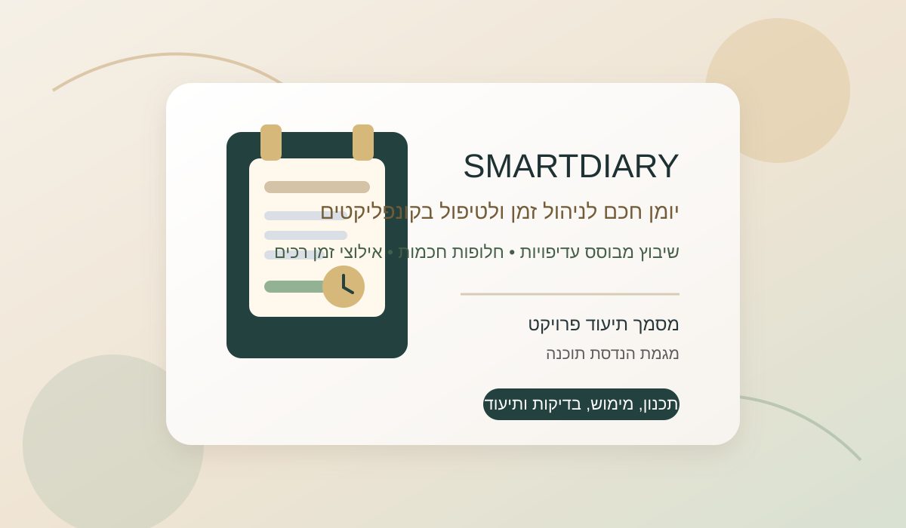
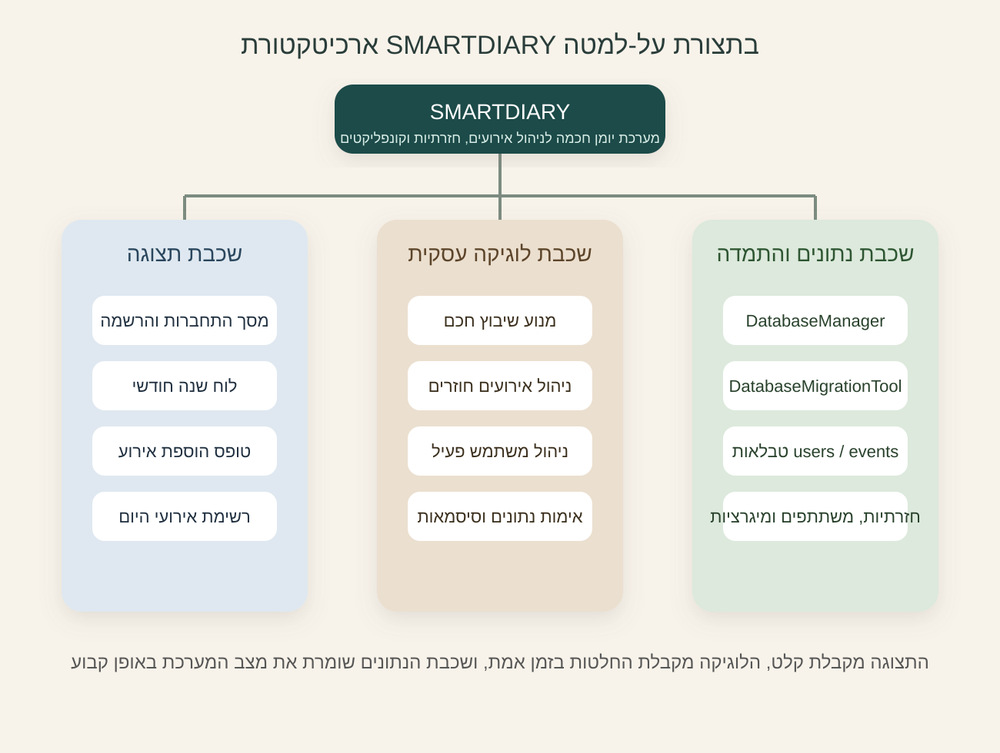
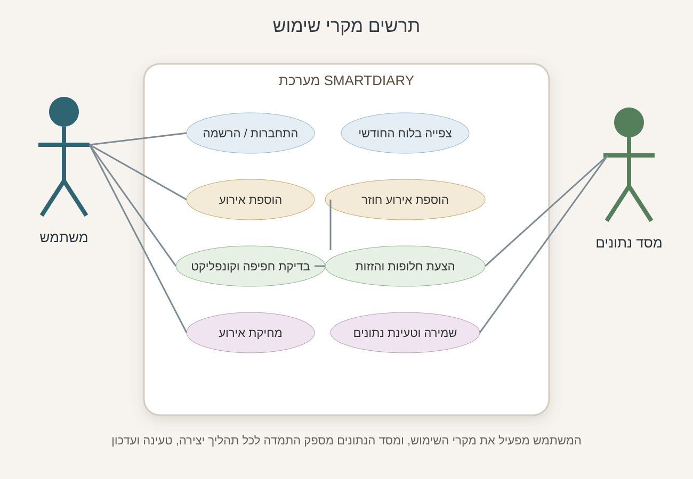
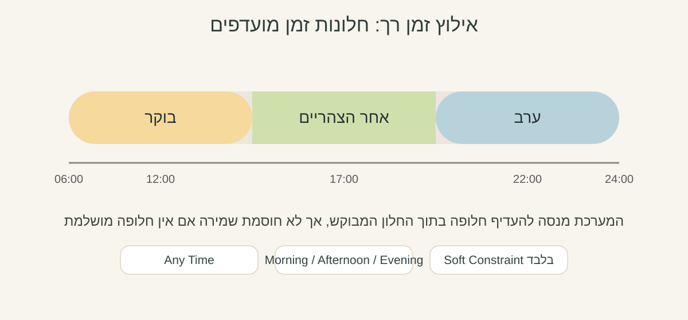
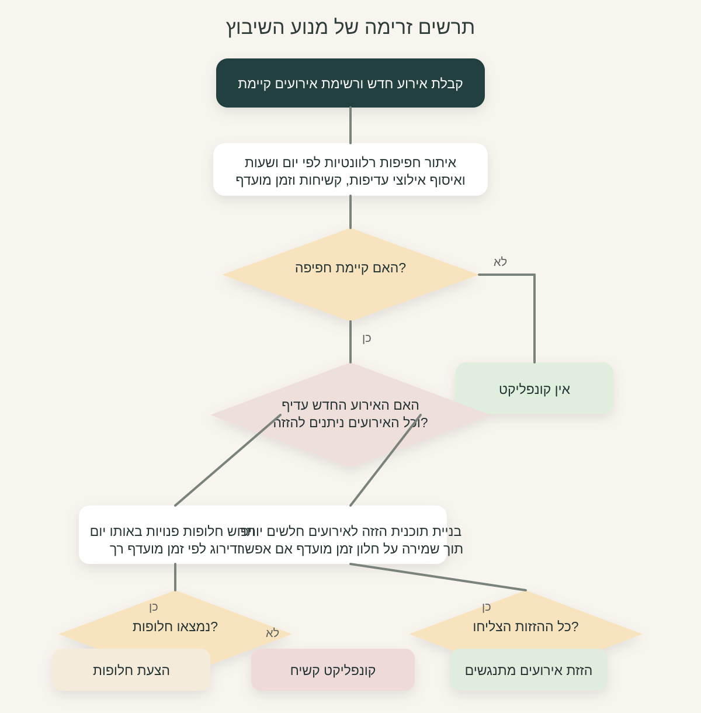
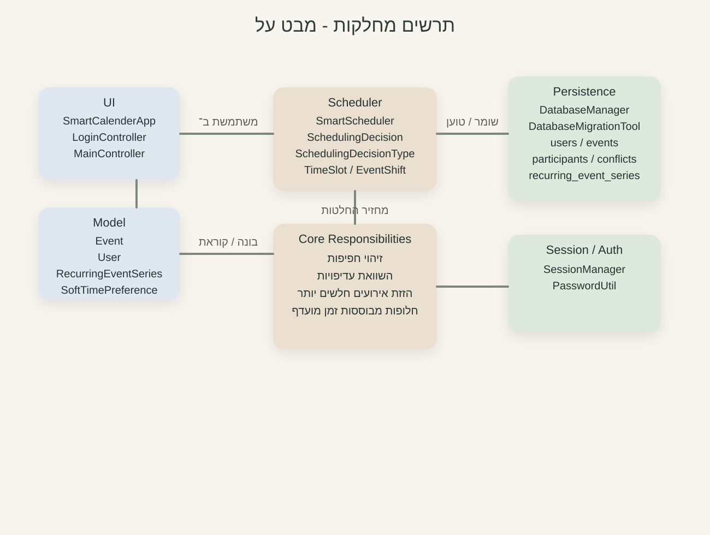

# תיק פרויקט
## SMARTDIARY - יומן חכם עם מנגנון שיבוץ אוטומטי
### עבודת גמר במגמת הנדסת תוכנה



שם הסטודנט: גילעד רפאלי

ת"ז: 215837014

שם המנחה: דגנית מוכתר-אבל

סמל מוסד: 440065

תאריך הגשה: 21.03.2026

[[PAGEBREAK]]

## תוכן עניינים

1. תקציר
2. הצעת הפרויקט שאושרה
3. תצהיר מקוריות
4. מושגים רלוונטיים
5. תיאור הנושא
6. רקע תיאורטי
7. תיאור הבעיה האלגוריתמית
8. סקירת פתרונות אלגוריתמיים
9. הפתרון שנבחר והנימוק לבחירה
10. ארכיטקטורת המערכת בתצורת על-למטה
11. תרשים מקרי שימוש
12. מבני הנתונים
13. סביבת העבודה ושפת התכנות
14. פסאודו-קוד של האלגוריתם המרכזי
15. תיאור הממשקים החיצוניים
16. תרשים מחלקות
17. תיאור המחלקות והפונקציות המרכזיות
18. פסאודו-קוד של התוכנית הראשית
19. מדריך למשתמש
20. בדיקות ואימות
21. סיכום אישי ורפלקציה
22. ביבליוגרפיה
23. נספח א'
24. נספח ב'

[[PAGEBREAK]]

## 1. תקציר

הפרויקט `SMARTDIARY` הוא יומן חכם שולחני לניהול זמן, שפותח ב-`Java 17` וב-`JavaFX`. מטרת המערכת היא לאפשר למשתמש לנהל אירועים חד-פעמיים ואירועים חוזרים, לשייך משתתפים לאירועים, לזהות חפיפות בלוח הזמנים, ולהציע פתרונות אוטומטיים לקונפליקטים.

החידוש המרכזי בפרויקט הוא מנגנון שיבוץ חכם, אשר מקבל אירוע חדש ורשימת אירועים קיימת, ובמקרה של חפיפה מחליט בין כמה חלופות:

1. הוספה מיידית כאשר אין חפיפה.
2. הזזה אוטומטית של אירועים חלשים יותר.
3. הצעת חלונות זמן חלופיים לאירוע החדש.
4. סימון מצב כקונפליקט קשיח כאשר אין פתרון אוטומטי סביר.

המערכת כוללת גם שכבת התחברות והרשמה, שמירת נתונים קבועה במסד נתונים מסוג `Microsoft Access`, תמיכה באירועים חוזרים, ורכיב בדיקות אוטומטיות עבור הלוגיקה וההתמדה.

הבעיה האלגוריתמית שבמרכז הפרויקט היא בעיית הכרעה במצבי חפיפה בלוח זמנים, תחת אילוצי עדיפות, קשיחות אירוע וזמינות. המימוש הסופי בוחר בפתרון היריסטי מקומי, מהיר, ברור וקל להסבר, במקום בפתרון תאורטי כבד יותר שאינו מתאים למוצר שולחני אישי.

---

## 2. הצעת הפרויקט שאושרה

בהצעת הפרויקט המקורית הוגדר נושא העבודה כ"יומן חכם עם בעיית שיבוץ". הרעיון המרכזי היה לפתח מערכת לניהול זמן אישי שתוכל לא רק להציג חפיפות בין אירועים, אלא גם להכריע מהו הפתרון המתאים ביותר עבור המשתמש.

בהצעה הוגדרו שלוש חלופות עיקריות לטיפול בקונפליקט:

1. קבלת האירוע החדש ודחייה או הזזה של אירוע קיים בעל חשיבות נמוכה יותר.
2. דחיית האירוע החדש והצעת חלון זמן חלופי.
3. שינוי מינימלי של סדר היום כך שהפגיעה הכוללת תהיה קטנה ככל האפשר.

בנוסף, במסגרת ההצעה נסקרו כמה כיוונים אלגוריתמיים, ביניהם:

- שיבוץ לפי זמן סיום מוקדם.
- שיבוץ מבוסס עדיפויות.
- שיטה גרידית מבוססת משקלים.
- אלגוריתם גנטי.
- פתרון מבוסס סיפוק אילוצים.

במהלך הפיתוח התברר כי הפתרון המתאים ביותר למערכת בפועל הוא מנגנון שיבוץ מקומי, דטרמיניסטי, מבוסס עדיפויות, המשלב אינדוקס של האירועים לפי יום ולפי שעת התחלה/סיום. בחירה זו שומרת על רוח ההצעה המקורית, אך מתאימה טוב יותר למערכת שולחנית שבה נדרשת תגובה מהירה ושקופה.

---

## 3. תצהיר מקוריות

אני, גילעד רפאלי, מצהיר כי פרויקט זה, לרבות הקוד והתיעוד, בוצע על ידי באופן עצמאי. כל שימוש במקור מידע חיצוני, מסמך הנחיה, או כלי עזר תועד בביבליוגרפיה. לצורך עריכה, שיפור ניסוח וסידור המסמך נעשה שימוש גם בכלי בינה מלאכותית, אולם כלי זה לא החליף את פיתוח הקוד, את תכנון המערכת או את הבנת הלוגיקה האלגוריתמית.

---

## 4. מושגים רלוונטיים

### 4.1 אירוע

עצם לוגי המייצג משימה, פגישה או פעילות ביומן. לכל אירוע יש:

- מזהה ייחודי.
- מזהה משתמש.
- זמן התחלה וזמן סיום.
- רמת עדיפות.
- תיאור ומיקום.
- מזהה סדרת חזרתיות אם הוא שייך לאירוע חוזר.

### 4.2 אירוע קשיח

אירוע שאסור להזיז אוטומטית. בקוד הוא מיוצג על ידי עדיפות `6`. אירוע כזה משמש כעוגן בלוח הזמנים.

### 4.3 אירוע חוזר

אירוע שנוצר מתבנית סדרתית ויכול לחזור:

- כל יום
- כל שבוע
- כל חודש

עד תאריך מסוים, או לטווח עתידי מוגבל כאשר המשתמש בוחר באפשרות "ללא סוף".

### 4.4 חפיפה

מצב שבו שני אירועים תופסים חלק משותף בציר הזמן. תנאי החפיפה שבו משתמשת המערכת הוא:

`התחלה א' < סיום ב' וגם סיום א' > התחלה ב'`

### 4.5 חלון זמן חלופי

טווח זמן פנוי שאורכו זהה לאורך האירוע החדש, ואשר נמצא באותו יום, בקפיצות של 30 דקות.

### 4.6 החלטת שיבוץ

אובייקט שמחזיר מנוע השיבוץ, ובו:

- סוג ההחלטה
- הסבר מילולי
- חלופות מוצעות
- הזזות אפשריות של אירועים אחרים

### 4.7 אילוץ זמן רך

אילוץ שאינו חוסם את שמירת האירוע, אך משפיע על דירוג החלופות שמציעה המערכת. בפרויקט זה המשתמש יכול לסמן העדפת זמן כללית כגון:

- בוקר
- אחר הצהריים
- ערב
- ללא העדפה

כאשר המערכת מחפשת חלופה או מנסה להזיז אירוע קיים, היא מנסה קודם חלונות זמן שמתאימים להעדפה זו, ורק אם לא נמצא פתרון מתאים היא חוזרת להתנהגות הרגילה.

---

## 5. תיאור הנושא

ניהול זמן הוא בעיה יומיומית של כמעט כל משתמש. יומנים דיגיטליים רגילים יודעים להציג אירועים, לסמן מועדים ולהתריע על חפיפה, אך ברגע שבו מתרחשת התנגשות בין שתי פעילויות, רוב המערכות משאירות את מלאכת ההכרעה בידי המשתמש.

מטרת הפרויקט היא להפוך את היומן ממערכת רישום פסיבית למערכת תומכת החלטה. במקום רק להתריע על בעיה, המערכת מנסה להציע פתרון. כאשר המשתמש מוסיף אירוע חדש, המערכת בודקת את המצב הקיים, משווה עדיפויות, לוקחת בחשבון אירועים קשיחים, ובוחרת את מסלול הפעולה המתאים ביותר.

מעבר לכך, הפרויקט אינו עוסק רק באלגוריתם, אלא במערכת מלאה:

- התחברות והרשמה של משתמשים.
- ניהול יומן חודשי.
- הוספת אירועים.
- מחיקת אירועים.
- ניהול משתתפים.
- יצירת אירועים חוזרים.
- שמירה קבועה של הנתונים.

לכן, הערך של הפרויקט הוא כפול: גם פתרון של בעיית הכרעה אלגוריתמית, וגם בניית מוצר תוכנה שלם.

---

## 6. רקע תיאורטי

בעיות שיבוץ שייכות למשפחה רחבה של בעיות תכנון והקצאה. במקרים רבים, הנתונים אינם רק זמני התחלה וסיום, אלא גם עדיפויות, משאבים, אילוצים קשיחים, אילוצים רכים, ותלות בין משימות. ככל שמספר התנאים גדול יותר, כך מרחב האפשרויות גדל במהירות.

במקרה של יומן אישי חכם, המערכת נדרשת לקבל החלטה מקומית בזמן אמת. היא איננה צריכה לחשב תכנית אופטימלית לשנה שלמה, אלא להכריע מה לעשות ברגע שבו נוסף אירוע חדש. זהו הבדל חשוב בין פתרון תאורטי כללי לבין מערכת פרקטית.

בפרויקט זה נבחרה גישה מעשית, שמטרתה:

- לספק תשובה מהירה.
- למזער הפרעה לסדר היום.
- לשמור על אירועים חשובים יותר.
- לאפשר למשתמש להבין את ההמלצה.

מבחינה הנדסית, בחירה זו עדיפה על פתרונות כבדים יותר, משום שהיא מתאימה ליישום מקומי, נוחה לבדיקה, ויוצרת מערכת יציבה ופשוטה יותר לתחזוקה.

---

## 7. תיאור הבעיה האלגוריתמית

### 7.1 הגדרת הבעיה

בהינתן אירוע חדש ורשימת אירועים קיימת, נדרש לקבוע מהו אופן השיבוץ הנכון ביותר עבור האירוע החדש, כאשר ייתכן שהוא חופף לאירוע אחד או יותר.

### 7.2 קלט

הקלט לאלגוריתם כולל:

- תאריך האירוע
- שעת התחלה
- שעת סיום
- רמת עדיפות
- מידע האם האירוע קשיח
- מידע על חלון זמן מועדף רך
- רשימת אירועים קיימים של המשתמש ושל משתתפים רלוונטיים

### 7.3 פלט

אחת מההחלטות הבאות:

- אין קונפליקט
- הזזת אירועים מתנגשים
- הצעת חלופות לאירוע החדש
- קונפליקט קשיח

### 7.4 אילוצים

- אירוע קשיח אינו זז.
- חלופות מחפשים באותו יום בלבד.
- חלופות נבדקות במרווחים של 30 דקות.
- משך החלופה חייב להיות זהה למשך האירוע החדש.
- אירוע חוזר מאושר רק אם כל אחד מהמופעים העתידיים עובר את בדיקת החפיפה.
- חלון זמן מועדף הוא אילוץ רך בלבד: המערכת מעדיפה אותו אך אינה חוסמת אירוע אם לא נמצא חלון מושלם.

### 7.5 מטרת האלגוריתם

המטרה היא למצוא פתרון שישלב בין שלושה עקרונות:

1. שמירה על נכונות לוגית.
2. צמצום הפרעה ללוח הזמנים.
3. תגובה מהירה וברורה למשתמש.

---

## 8. סקירת פתרונות אלגוריתמיים

### 8.1 שיבוץ לפי זמן סיום מוקדם

זוהי שיטה קלאסית שבה בוחרים קודם את האירוע שמסתיים מוקדם, משום שהוא משאיר יותר מקום לאירועים אחרים. היתרון שלה הוא פשטות ומהירות, אך היא אינה מתאימה היטב לפרויקט זה, משום שהיא אינה מתחשבת בחשיבות האירוע או ברמת הקשיחות שלו.

### 8.2 שיבוץ מבוסס עדיפות

בגישה זו לכל אירוע יש דרגת חשיבות. כאשר יש חפיפה, המערכת מעדיפה לשמר את האירוע בעל העדיפות הגבוהה יותר. גישה זו מתאימה מאוד לפרויקט משום שהיא תואמת לאופן שבו משתמשים חושבים בפועל על לוח הזמנים שלהם.

### 8.3 שיטה גרידית מבוססת משקל

שיטה זו מרחיבה את רעיון העדיפות ומאפשרת להעריך "עלות" או "משקל" של כל החלטה. יתרונה הוא איזון בין יעילות לבין איכות פתרון, אך חסרונה בכך שהיא עלולה לבחור פתרון טוב מקומית אך לא הטוב ביותר ברמה גלובלית.

### 8.4 אלגוריתם גנטי

מדובר בשיטה חזקה וגמישה, המאפשרת לחפש פתרון טוב מתוך מספר רב של חלופות. עם זאת, היא פחות מתאימה כאן משום שהיא כבדה יותר, קשה להסבר למשתמש, ודורשת תכנון מתמטי מפורט יותר.

### 8.5 פתרון מבוסס סיפוק אילוצים

בגישה זו מגדירים משתנים, תחומי ערכים ואילוצים, ומצמצמים את מרחב החיפוש. זהו פתרון אקדמי מסודר, אך עבור מערכת יומן אישית קטנה הוא מורכב יחסית לצורך.

### 8.6 מסקנה מסעיף הסקירה

לאחר בחינת האפשרויות, נמצא כי השילוב המתאים ביותר למערכת הוא:

- שיבוץ מבוסס עדיפות
- חיפוש גרידי מקומי
- אינדוקס ממויין של האירועים לפי יום

שילוב זה הוא גם פרקטי, גם מהיר, וגם תואם למימוש בפועל.

---

## 9. הפתרון שנבחר והנימוק לבחירה

הפתרון הסופי שבוצע בפרויקט הוא מנגנון שיבוץ מקומי, דטרמיניסטי, מבוסס עדיפויות, עם הצעת חלופות, חיפוש הזזות לאירועים חלשים יותר, והתחשבות באילוצי זמן רכים מסוג preferred time.

### 9.1 עקרון הפעולה

המנגנון פועל בשלבים:

1. אינדוקס האירועים לפי יום.
2. איתור חפיפות רלוונטיות בלבד.
3. השוואת עדיפות בין האירוע החדש לבין האירועים המתנגשים.
4. ניסיון להזיז אירועים מתנגשים אם הם חלשים יותר ואינם קשיחים.
5. אם הזזה אינה אפשרית, חיפוש חלונות זמן חלופיים.
6. דירוג החלופות כך שחלון זמן מועדף יקבל עדיפות כאשר הוא זמין.
7. אם גם זה אינו אפשרי, החזרת קונפליקט קשיח.

### 9.2 נימוק לבחירה

הפתרון נבחר משום שהוא:

- מהיר מספיק להפעלה בזמן אמת.
- ניתן להסבר למשתמש.
- מתאים ליומן אישי ולא למערכת תעשייתית מורכבת.
- פשוט יחסית לבדיקה אוטומטית.
- תואם לקוד ולמבנה המחלקות שבפרויקט.

### 9.3 יתרונות

- תגובה מהירה.
- תוצאה צפויה.
- הבחנה ברורה בין אירועים רגילים לאירועים קשיחים.
- הפרדה טובה בין לוגיקת ההכרעה לבין ממשק המשתמש.

### 9.4 מגבלות

- חיפוש החלופות מתבצע באותו יום בלבד.
- הצעדים הם בני 30 דקות בלבד.
- האלגוריתם הוא מקומי ואינו מבטיח פתרון גלובלי אופטימלי.
- אירועים החוצים חצות אינם חלק ממודל העבודה המרכזי.

---

## 10. ארכיטקטורת המערכת בתצורת על-למטה

### 10.1 תיאור כללי

המערכת בנויה משלוש שכבות מרכזיות:

1. שכבת תצוגה
2. שכבת לוגיקה עסקית
3. שכבת נתונים והתמדה

### 10.2 פירוק היררכי



התרשים מציג את פירוק המערכת לשלוש שכבות ברורות: תצוגה, לוגיקה עסקית והתמדה. הבחירה במבנה זה מסייעת בהפרדת אחריות, בפשטות בדיקה, וביכולת להרחיב את המערכת בלי לפגוע בכל רכיב אחר.

### 10.3 פירוט תתי-המערכות

#### שכבת התצוגה

- אחראית על קליטת נתונים מהמשתמש.
- מציגה את הלוח, את האירועים ואת ההמלצות.

#### שכבת הלוגיקה העסקית

- אחראית על קבלת החלטות, יצירת מופעים חוזרים וטיפול בכלל החוקים.

#### שכבת הנתונים

- אחראית על שמירה, טעינה, עדכון ומחיקה של הנתונים.

---

## 11. תרשים מקרי שימוש

### 11.1 שחקנים

- משתמש
- מנגנון שיבוץ
- מסד נתונים

### 11.2 מקרי שימוש

- התחברות
- הרשמה
- צפייה בלוח חודשי
- בחירת יום
- הוספת אירוע
- הוספת אירוע חוזר
- הוספת משתתפים
- בדיקת חפיפה
- קבלת חלופה
- מחיקת אירוע
- התנתקות



התרשים מדגיש שהמשתמש מפעיל את תהליכי הליבה של המערכת, בעוד שמסד הנתונים תומך בכל שלב של טעינה, שמירה ועדכון. בדיקת הקונפליקט והצעת החלופות הן מקרי השימוש האלגוריתמיים המרכזיים של הפרויקט.

---

## 12. מבני הנתונים

המערכת עושה שימוש בכמה מבני נתונים עיקריים:

| מבנה נתונים | שימוש בפועל | נימוק לבחירה |
|---|---|---|
| `ArrayList<Event>` | שמירת רשימות אירועים בזיכרון | פשוט, מהיר ונוח למיון |
| `ArrayList<User>` | שמירת רשימות משתמשים ומשתתפים | מתאים לכמות הנתונים ולשימוש במסך |
| `LinkedHashSet<Integer>` | איסוף מזהי משתמשים ללא כפילויות | שומר סדר ומונע כפילויות |
| `TreeMap<LocalDate, DayIndex>` | אינדוקס אירועים לפי יום | מאפשר גישה לפי תאריך |
| `TreeSet<Event>` | מיון אירועים לפי התחלה/סיום | תומך בחיפוש יעיל למועמדים לקונפליקט |
| `ObservableList` | חיבור נתונים לרכיבי JavaFX | מבנה טבעי לעדכון מסך |

### חשיבות מבני הנתונים בפרויקט

בחירת מבני הנתונים אינה מקרית. היא קשורה ישירות לבעיה האלגוריתמית:

- אם כל אירוע היה נבדק מול כל אירוע אחר, הביצועים היו נמוכים יותר.
- שימוש במבנים ממוינים מאפשר לצמצם את קבוצת המועמדים הרלוונטיים.
- ההפרדה בין ייצוג בזיכרון לבין השמירה במסד תורמת גם למהירות וגם לפשטות הקוד.

---

## 13. סביבת העבודה ושפת התכנות

### 13.1 טכנולוגיות

- שפת הפיתוח: `Java 17`
- מסגרת ממשק: `JavaFX`
- תיאור מסכים: `FXML`
- מסד נתונים: `Microsoft Access`
- גישה למסד: `UCanAccess`
- ניהול תלויות: `Maven`
- בדיקות: `JUnit 5`
- סביבת פיתוח: `IntelliJ IDEA`

### 13.2 מבנה הפרויקט

- `src/main/java` - קוד המקור הראשי
- `src/main/resources` - קובצי תצוגה
- `src/test/java` - בדיקות אוטומטיות
- `pom.xml` - תלויות והגדרות בנייה

### 13.3 הערה לגבי המימוש בפועל

בהצעת הפרויקט הוזכרו גם כיוונים של `JSON / SQL`, אך במימוש בפועל נבחר מסד `Access`, משום שהוא פתרון מקומי נוח, ישים, ועבד היטב עם אופי המערכת.

---

## 14. פסאודו-קוד של האלגוריתם המרכזי

לפני הצגת הפסאודו-קוד, חשוב להדגיש שהגרסה הסופית של המנוע אינה בודקת רק חפיפה קשיחה בזמן, אלא גם מדרגת פתרונות לפי העדפת זמן רכה של המשתמש.





```pseudo-he
קלט: אירוע חדש, רשימת אירועים קיימת
פלט: החלטת שיבוץ

1. בנה אינדקס של האירועים לפי יום
2. אתר את קבוצת האירועים שחופפת לאירוע החדש
3. אם אין חפיפה:
      החזר "אין קונפליקט"
4. חשב את העדיפות המרבית מבין האירועים המתנגשים
5. בדוק אם יש אירועים קשיחים
6. אם האירוע החדש חשוב יותר ואין אירועים קשיחים:
      נסה להזיז כל אירוע מתנגש לחלון פנוי מתאים
      אם כל ההזזות הצליחו:
           החזר "הזז אירועים מתנגשים"
7. אם האירוע החדש אינו קשיח:
      חפש חלונות זמן חלופיים באותו יום
      דרג את החלופות כך שחלון מועדף יקודם ראשון
      אם נמצאו חלופות:
           החזר "הצע חלופות"
8. אחרת:
      החזר "קונפליקט קשיח"
```

---

## 15. תיאור הממשקים החיצוניים

### 15.1 ממשק המשתמש

מסך העבודה הראשי כולל:

- כותרת עליונה עם פרטי משתמש וניווט בין חודשים.
- לוח חודשי.
- טופס הוספת אירוע.
- רשימת אירועים ליום נבחר.

השדות המרכזיים בטופס:

- כותרת
- תאריך
- שעת התחלה
- שעת סיום
- עדיפות
- חזרתיות
- משך חזרתיות
- זמן מועדף רך
- תיאור
- מיקום
- משתתפים
- הפעלת בדיקת חפיפות חכמה

### 15.2 ממשק למסד הנתונים

הגישה למסד מרוכזת במחלקה `DatabaseManager`, אשר מספקת פעולות כגון:

- חיבור למסד
- אימות משתמש
- רישום משתמש
- שמירת אירוע
- טעינת אירועים
- מחיקת אירוע
- יצירת סדרת אירועים חוזרת

### 15.3 סכמת הנתונים

הטבלאות העיקריות במערכת:

- `users`
- `events`
- `participants`
- `conflicts`
- `recurring_event_series`
- `recurring_participants`
- `schema_migrations`

---

## 16. תרשים מחלקות



### 16.1 פירוש התרשים

- `SmartCalenderApp` מפעילה את מסכי המערכת.
- `LoginController` מטפל בהתחברות והרשמה.
- `MainController` שולט במסך הראשי.
- `SmartScheduler` מקבל החלטות שיבוץ.
- `DatabaseManager` מרכז את כל פעולות הגישה למסד הנתונים.
- `RecurringEventSeries` מייצרת מופעים חוזרים.
- `Event`, `User`, `RecurringEventSeries` ו-`SoftTimePreference` הם עצמי המודל המרכזיים.

---

## 17. תיאור המחלקות והפונקציות המרכזיות

### 17.1 המחלקה `SmartCalenderApp`

תפקידה להפעיל את האפליקציה ולהחליף מסכים.

| פונקציה | קלט | פלט | תפקיד |
|---|---|---|---|
| `start` | `Stage` | אין | הפעלת היישום |
| `showLoginView` | אין | אין | טעינת מסך התחברות |
| `showMainView` | אין | אין | טעינת המסך הראשי |

### 17.2 המחלקה `LoginController`

תפקידה לנהל את תהליך ההתחברות והרישום.

| פונקציה | קלט | פלט | תפקיד |
|---|---|---|---|
| `login` | שדות טופס התחברות | אין | בדיקת פרטי משתמש |
| `register` | שדות טופס הרשמה | אין | יצירת משתמש חדש |

### 17.3 המחלקה `MainController`

זוהי המחלקה המרכזית של המסך הראשי.

| פונקציה | קלט | פלט | תפקיד | יעילות בקירוב |
|---|---|---|---|---|
| `initialize` | כתובת ומשאבים | אין | טעינת המסך והנתונים | תלויה בטעינה הראשונית |
| `addEvent` | אין | אין | התחלת תהליך הוספת אירוע | תלויה בתרחיש |
| `buildEventFromForm` | אין | `Event` | בניית אירוע מהטופס | `O(1)` |
| `addSingleEvent` | `Event` | אין | שמירת אירוע חד-פעמי | תלויה בבדיקת שיבוץ ובמסד |
| `addRecurringEvent` | `Event` | אין | יצירת סדרה חוזרת | תלויה במספר המופעים |
| `handleDecision` | אירוע + החלטה | `boolean` | טיפול בהחלטת המנוע | תלוי במספר חלופות/הזזות |
| `loadSchedulingScopeEvents` | אין | רשימת אירועים | טעינת אירועי משתמשים רלוונטיים | תלויה במסד |

### 17.4 המחלקה `SmartScheduler`

מנוע ההכרעה של המערכת.

| פונקציה | קלט | פלט | תפקיד |
|---|---|---|---|
| `decide` | אירוע חדש + רשימת אירועים | `SchedulingDecision` | החזרת החלטה מלאה |
| `findConflicts` | אירוע יעד + אירועים קיימים | רשימת אירועים | זיהוי חפיפות |
| `proposeShifts` | אירוע חדש + קונפליקטים | רשימת הזזות | חיפוש פתרון של הזזת אירועים |
| `findAlternativeSlots` | אירוע חדש | רשימת חלופות | הצעת חלונות זמן חלופיים המדורגים גם לפי זמן מועדף |
| `findBestFreeSlot` | אירוע מתנגש + אינדקס יום | חלון זמן או ריק | איתור חלון חלופי מתאים להזזה |

#### פסאודו-קוד לפונקציה `decide`

```pseudo-he
קבל אירוע חדש ורשימת אירועים קיימים
מצא חפיפות
אם אין חפיפות:
    החזר "אין קונפליקט"
אם האירוע החדש בעל עדיפות גבוהה יותר וכל האירועים ניתנים להזזה:
    נסה לבנות תוכנית הזזה
    אם הצליח:
        החזר "הזזת אירועים"
אם האירוע החדש אינו קשיח:
    מצא חלופות
    דרג חלופות לפי זמן מועדף אם קיים
    אם נמצאו:
        החזר "חלופות"
החזר "קונפליקט קשיח"
```

### 17.5 המחלקה `DatabaseManager`

מחלקה זו מהווה שכבת גישה למסד הנתונים.

| פונקציה | קלט | פלט | תפקיד |
|---|---|---|---|
| `connect` | אין | אין | פתיחת חיבור והרצת מיגרציה |
| `disconnect` | אין | אין | סגירת חיבור |
| `insertEvent` | `Event` | `boolean` | שמירת אירוע |
| `updateEvent` | `Event` | `boolean` | עדכון אירוע |
| `deleteEvent` | מזהה אירוע | `boolean` | מחיקת אירוע |
| `createRecurringEventSeries` | סדרה + משתתפים | `int` | יצירת סדרה והחמרת מופעים |
| `authenticateUser` | שם משתמש + סיסמה | `User` | אימות משתמש |
| `registerUser` | פרטי משתמש | `User` | רישום משתמש |
| `getCalendarEventsForUser` | מזהה משתמש | `List<Event>` | טעינת אירועים ליומן |

### 17.6 המחלקה `RecurringEventSeries`

אחראית על הפקת מופעים ממשיים מתוך תבנית של אירוע חוזר.

| פונקציה | קלט | פלט | תפקיד |
|---|---|---|---|
| `buildOccurrences` | תאריך סיום כולל | רשימת אירועים | יצירת כל המופעים העתידיים |

#### פסאודו-קוד לפונקציה `buildOccurrences`

```pseudo-he
אם תאריך הסיום קודם להתחלה:
    החזר רשימה ריקה
חשב את משך האירוע
כל עוד זמן המופע הבא בטווח:
    צור אירוע חדש
    הוסף לרשימה
    התקדם ביום / שבוע / חודש
החזר את הרשימה
```

### 17.7 המחלקות `Event` ו-`User`

אלה מחלקות המודל המרכזיות. הן מחזיקות את פרטי הישות בלבד, ומשמשות להעברת נתונים בין שכבת המסך, שכבת הלוגיקה ושכבת ההתמדה.

### 17.8 המחלקה `DatabaseMigrationTool`

מחלקה זו אחראית ליצירת הטבלאות ולהשלמת שדות חסרים במסד הנתונים, כך שהמערכת תוכל לעבוד גם אם הקובץ קיים בגרסה ישנה יותר.

---

## 18. פסאודו-קוד של התוכנית הראשית

```pseudo-he
הפעל את SmartCalenderApp
טען מסך התחברות
אם המשתמש הצליח להתחבר או להירשם:
    שמור את המשתמש הפעיל
    טען את המסך הראשי

באתחול המסך הראשי:
    התחבר למסד הנתונים
    הרץ מיגרציה
    טען את המשתמשים ואת האירועים
    אתחל את רכיבי המסך
    הצג את החודש הנוכחי

כאשר המשתמש מוסיף אירוע:
    בנה אירוע מהטופס
    אם מדובר באירוע חוזר:
        צור סדרת חזרתיות
        בדוק מופעים עתידיים
        שמור סדרה ומופעים
    אחרת:
        אם בדיקת חפיפה חכמה מופעלת:
            קבל החלטה ממנוע השיבוץ
            החל את ההחלטה
        שמור את האירוע
    רענן את לוח השנה ואת רשימת האירועים
```

---

## 19. מדריך למשתמש

### 19.1 התחברות והרשמה

1. פתיחת האפליקציה תוביל למסך התחברות.
2. ניתן להתחבר עם משתמש קיים או לבצע רישום.
3. לאחר התחברות מוצלחת נפתח המסך הראשי.

### 19.2 צפייה בלוח החודשי

1. בחלק העליון ניתן לעבור חודש אחורה או קדימה.
2. ניתן ללחוץ על "Today" כדי לחזור ליום הנוכחי.
3. בלחיצה על יום מסוים, בתחתית המסך תופיע רשימת האירועים של אותו יום.

### 19.3 הוספת אירוע רגיל

1. הזן כותרת.
2. בחר תאריך.
3. בחר שעת התחלה ושעת סיום.
4. בחר רמת עדיפות.
5. בחר זמן מועדף רך אם יש העדפה כללית.
6. הוסף תיאור ומיקום אם צריך.
7. הוסף משתתפים במידת הצורך.
8. בחר האם להפעיל בדיקת חפיפה חכמה.
9. לחץ על כפתור ההוספה.

### 19.4 הוספת אירוע חוזר

1. בחר סוג חזרתיות.
2. בחר האם הסדרה נמשכת לנצח או למשך מספר ימים, שבועות או חודשים.
3. הזן כמות במידת הצורך.
4. לחץ על כפתור ההוספה.

### 19.5 מה קורה במקרה של קונפליקט

- אם אין חפיפה, האירוע נשמר מייד.
- אם קיימים אירועים חלשים יותר, המערכת עשויה להציע להזיז אותם.
- אם עדיף להזיז את האירוע החדש, המערכת תציע חלופות.
- אם מדובר במצב קשיח, תוצג למשתמש אזהרה.

### 19.6 מחיקת אירוע

1. בחר יום.
2. בחר אירוע מהרשימה.
3. לחץ על מחיקה.
4. אם מדובר באירוע מתוך סדרה חוזרת, המערכת תאפשר בחירה בין מחיקת מופע יחיד למחיקת כל הסדרה.

---

## 20. בדיקות ואימות

בפרויקט קיימות בדיקות אוטומטיות שבודקות את תקינות המערכת ברמות שונות:

### 20.1 בדיקות מנוע השיבוץ

הבדיקות ב-`SmartSchedulerTest` בודקות:

- מצב ללא קונפליקט.
- מצב שבו אירוע חדש חזק יותר ולכן מוזזים אירועים קיימים.
- מצב שבו מוצעות חלופות.
- מצב של אירועים קשיחים.
- מצב שבו חלופות מועדפות מדורגות גבוה יותר כאשר מוגדר preferred time.

### 20.2 בדיקות אירועים חוזרים

הבדיקות ב-`RecurringEventSeriesTest` מוודאות:

- יצירת סדרה יומית.
- יצירת סדרה שבועית.
- יצירת סדרה חודשית.

### 20.3 בדיקות התמדה

הבדיקות ב-`DatabaseManagerTest` וב-`DatabaseManagerCrudFlowTest` מאמתות:

- חיבור למסד הנתונים.
- הוספת אירוע.
- עדכון אירוע.
- מחיקת אירוע.
- יצירת סדרת חזרתיות ושיוך משתתפים.
- שמירת ההעדפה של זמן מועדף רך באירועים ובסדרות חוזרות.

### 20.4 בדיקת טעינת מסך

הבדיקה `MainViewSmokeTest` בודקת שהמסך הראשי נטען כראוי ושכל רכיבי הממשק המרכזיים קיימים.

### 20.5 תוצאת האימות

בבדיקה שבוצעה על הפרויקט הנוכחי, הרצת `mvn test` עברה בהצלחה.

---

## 21. סיכום אישי ורפלקציה

העבודה על הפרויקט חיברה עבורי בין כמה תחומים שלמדתי במהלך הלימודים: תכנות מונחה עצמים, מבני נתונים, עבודה עם מסדי נתונים, בניית ממשק משתמש, וחשיבה אלגוריתמית. אחד הדברים החשובים שלמדתי הוא שהמעבר מרעיון תאורטי למערכת עובדת דורש פשרות נכונות. לא תמיד הפתרון שנראה "מתוחכם" יותר על הנייר הוא גם הפתרון הנכון למוצר אמיתי.

בשלב מוקדם של העבודה שקלתי פתרונות כבדים יותר, אך תוך כדי פיתוח הבנתי שהמערכת צריכה להיות ברורה, מהירה ויציבה. לכן בחרתי במנגנון שיבוץ מקומי מבוסס עדיפות. בדיעבד, זו הייתה החלטה נכונה, משום שהיא אפשרה לי לבנות מערכת מלאה ולא רק הדגמה של אלגוריתם.

הקושי המרכזי מבחינתי היה חלוקת האחריות בין חלקי המערכת. היה צורך לחבר בין ממשק משתמש, מסד נתונים, ניהול משתמשים, אירועים חוזרים ומנוע החלטה. העבודה על החיבור בין כל החלקים חידדה לי את החשיבות של ארכיטקטורה מסודרת ושל בדיקות אוטומטיות.

אם הייתי מתחיל מחדש, הייתי מכין מוקדם יותר תרשימי מערכת ותיעוד ארכיטקטוני, ואולי גם יוצר שכבת שירות נפרדת בין `MainController` לבין `DatabaseManager`. בנוסף, הייתי שוקל להרחיב את המערכת כך שתדע להציע חלופות גם לימים אחרים, ולא רק לאותו יום.

מה שאני לוקח איתי מהפרויקט:

- הבנה טובה יותר של תכנון מערכת שלמה.
- חשיבות של בחירת מבני נתונים נכונים.
- חשיבות של הפרדה בין ממשק, לוגיקה והתמדה.
- החשיבות של בדיקות גם בפרויקט קטן יחסית.

---

## 22. ביבליוגרפיה

1. רפאלי, ג'. (2026). הצעת פרויקט: יומן חכם עם בעיית שיבוץ.
2. מוכתר-אבל, ד'. (2026). הנחיות לתיק פרויקט.
3. משרד החינוך. (2026). נוהל להגשת פרויקט י"ג בהנדסת תוכנה.
4. קוד המקור של פרויקט `SMARTDIARY`.
5. מסמך פנימי: `SMARTDIARY_Code_Explanation.docx`.
6. לצורך ניסוח וארגון המסמך נעשה שימוש בכלי `OpenAI Codex / ChatGPT`, בהתאם להנחיות שנמסרו לגבי ציון שימוש בכלי בינה מלאכותית.

---

## 23. נספח א' - קוד המקור שיש לצרף

בגרסת ההגשה הסופית יש לצרף כנספח:

- קוד המקור תחת `src/main/java`
- קובצי הממשק תחת `src/main/resources`
- קוד הבדיקות תחת `src/test/java`
- קובץ `pom.xml`

יש להדביק את הקוד כטקסט ולא כתמונה.

---

## 24. נספח ב' - הרחבות עתידיות אפשריות

הרחבות מומלצות להמשך:

1. תמיכה באירועים שחוצים חצות.
2. הרחבת חיפוש החלופות גם לימים סמוכים.
3. סנכרון עם יומנים חיצוניים.
4. שכבת שירות נפרדת ללוגיקה העסקית.
5. הוספת אופטימיזציות נוספות למסד הנתונים.
